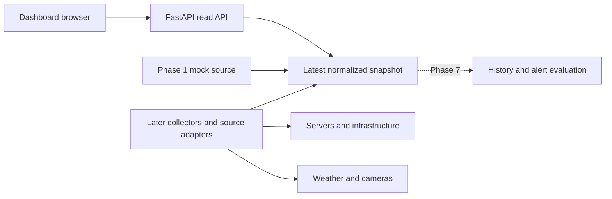

# HomeLab Dashboard implementation plan

Status: **Planning only. Implementation is paused.**

This repository is the target application for a separately developed agent
orchestrator. It does not implement the orchestrator. Creating an issue, assigning
a dependency, or having an existing PR does not authorize implementation.
The user must explicitly authorize implementation after the complete backlog has
been reviewed. Unresolved phase-specific decisions block their dependent work.

## 1. Confirmed requirements

- Fullscreen information display for a home lab, intended for continuous use.
- Confirmed UI language: Finnish.
- Confirmed display type: a standard computer monitor; exact resolution, size, orientation and browser are not yet specified.
- FastAPI/Python backend with pytest; React/TypeScript/Vite frontend.
- Version 0.1 uses mock data: server cards, CPU/RAM/disk usage, UP/DOWN status,
  weather card, and kiosk layout.
- Later phases add real server monitoring, Proxmox, pfSense/WAN/VPN, MikroTik,
  live weather/cameras/household information, then alerts and historical data.
- First plan the entire project and create its issues. Implementation comes later.
- The orchestrator's scheduling, agent management, approvals, credentials, worktrees,
  and PR automation belong to its own project, not this application's backlog.

## 2. Decisions and proposed defaults

Confirmed choices are identified below; other values remain proposals or open
questions. Do not silently turn an unknown into a supported integration or promise. Record decisions in this table
and update affected issues before their implementation starts.

| ID | Decision | Proposed default / open question | Blocks |
| --- | --- | --- | --- |
| D01 | Display and browser | Confirmed: standard computer monitor. Exact resolution, size, orientation and browser remain open. 1920×1080 and 1280×720 are proposed test viewports only, not confirmed hardware requirements | Final layout and kiosk acceptance |
| D02 | UI language and units | Confirmed: Finnish UI, including status/error/empty-state text. Celsius, metric units, 24-hour clock and Europe/Helsinki remain proposed defaults; API identifiers may stay English | Only remaining unit/time choices; language is resolved |
| D03 | Visible server count | Proposed six cards without scrolling at 1080p; explicit empty, one, six and overflow scenarios; overflow behavior to be decided | Layout acceptance |
| D04 | Deployment | Deferred: user cannot select the installation method yet. P1-11 must assess the eventual host and propose one supported path before packaging. No container/systemd choice is confirmed | Deployment packaging and acceptance, not current planning |
| D05 | Access boundary | Proposed read-only LAN display behind the existing network boundary; decide whether application login or reverse-proxy authentication is required | Deployment and live integration exposure |
| D06 | Physical/virtual server inventory | OS, host counts, identifiers, desired measurements, filesystem selection and available read-only monitoring interfaces unknown | Phase 2 collector choice |
| D07 | Proxmox | Edition/version, cluster/node inventory, guests, access and available metrics unknown | Phase 3 |
| D08 | pfSense / WAN / VPN | CE/Plus and version, supported access method, WAN/backup interfaces, gateway groups and VPN types unknown | Phase 4 |
| D09 | MikroTik | Device models, RouterOS versions, access method and important interfaces unknown | Phase 5 |
| D10 | Weather | Location, provider, current-vs-forecast requirements, attribution and provider limits unknown | Live weather; mock provider/location-independent |
| D11 | Cameras and household information | Camera source/protocol/count, snapshot-vs-video and permitted household widgets unknown | Camera/household issues |
| D12 | History and alerts | Retention, storage budget, thresholds, downtime semantics, acknowledgement and notification destination unknown | Phase 7 |
| D13 | Existing work | PRs #4–#6 were opened before planning; review against approved contracts later, reuse or revise explicitly | Acceptance of existing implementation |

Device versions and deployment details are intentionally unknown at this stage.
Do not request them as prerequisites for completing the project plan or designing
the mock dashboard. P2-01, P3-01, P4-01 and P5-01 own later inventory/version
discovery; their results block only the dependent live integrations. P1-11 owns
the deployment decision before packaging and deployment acceptance.

No passwords, API tokens, private keys or private device configuration belong in
issues or fixtures. Inventory records may use aliases instead of sensitive addresses.

## 3. Boundaries and architecture

The browser renders normalized dashboard data. FastAPI owns configuration and
source access. Source adapters produce a common snapshot. Version 0.1 has a mock
adapter only; live adapters arrive in their roadmap phases. In the first release,
latest data may stay in process memory and reset on restart. Persistent history is
a Phase 7 decision. A database, queue, push transport and plugin framework are not
required by the initial scope.

The orchestrator is outside this diagram: it develops the application but is not
a dashboard runtime dependency. Dashboard issues must be understandable on their
own, with explicit dependencies, deliverables and verification.

Proposed source layout for later implementation:

- `backend/app/`: API routes, models, source adapters, configuration and scheduling.
- `backend/tests/`: model, API and source-contract tests using fixtures.
- `frontend/src/`: dashboard components, API access, formatting and styles.
- `frontend/`: component and browser test configuration when introduced.
- `docs/`: architecture, decisions, acceptance and operations documentation.

The currently empty `orchestrator.py` and `worker.py` are legacy placeholders.
They are not implementation targets. Their removal is a later repository-cleanup
item, not part of this documentation change.

## 4. Data contract to finalize before dependent implementation

Issue P0-02 owns the normative contract and examples. The following proposal
identifies decisions that the three early scaffolding issues did not cover.

| Object | Proposed fields / semantics |
| --- | --- |
| Snapshot | Contract version, `generated_at`, `mode` (`mock`/`live`), server collection, weather and source health; future sections added compatibly |
| Server identity | Stable `id`, display `name`, `hostname`, physical/VM/container kind and optional parent identity; hostnames alone are not stable IDs |
| Server availability | `online`, `offline`, `unknown`; UP/DOWN labels map to the first two; no observation is UNKNOWN, not DOWN |
| Freshness | UTC `observed_at` for the latest successful source observation; `stale` derived from age, not from the API response time |
| CPU | Overall percentage across the host, finite 0–100; missing is `null` |
| Memory | Used percentage, with an explicit definition of cache/buffer treatment; source mapping documented before a live adapter |
| Disk | Used percentage with a selected filesystem or explicit aggregation rule; never average unrelated disks silently |
| Load | Decide what the requested `load` field means before reusing PR #6; do not assume runnable task count is the user's intended metric |
| Load averages | 1-, 5- and 15-minute values; finite and nonnegative, not percentages; unsupported platforms may report `null` |
| Weather | Location label, observation time, temperature in Celsius, normalized condition code; forecast/wind fields require an explicit scope decision |
| Source health | Per-source state/error category, last success and freshness; diagnostic details must not expose credentials |

A stopped VM, an unreachable host, an authentication failure and a stale metric
must not collapse into one generic DOWN state. The contract issue must decide
which observations prove availability and how those cases appear to the user.
The current Server model lacks stable identity and observation time; its existing
`load` definition is provisional. These are review findings, not changes made now.

Proposed initial endpoints:

- `GET /health`: process liveness, not a claim that all monitored services are UP.
- `GET /api/v1/dashboard`: one coherent dashboard snapshot, including mock weather.

Contract acceptance must specify JSON examples, optional fields, date formats,
error shape, compatibility rules, and empty/partial/source-failure responses.
Healthy API + failed monitored source should still return a usable snapshot;
an API-wide failure must be distinguishable from an individual device failure.
No inventory-editing or infrastructure-control API is planned for version 0.1.

## 5. Mock behavior and refresh state machine

Proposed initial values: browser refresh every 10 seconds, request timeout 5
seconds and stale threshold 30 seconds. Confirm them in P0-02. Tests should use a
controlled clock and not wait real seconds unnecessarily.

- First request: visible loading state, then ready, empty, partial or failed state.
- Later request fails: retain last valid data, show connection error and its age.
- Data crosses the stale threshold: mark it stale; never keep an unqualified UP
  presentation indefinitely.
- Recovery: update the snapshot, remove connection error and reset freshness based
  on observation time. Invalid payloads cannot replace a valid snapshot silently.
- Only one active refresh request per view; cancel on unmount and ignore late
  responses that would overwrite newer data. No duplicate interval loops.
- A configured finite retry policy must avoid a rapid retry loop after failure.
- Mock mode is visibly identified so it cannot be mistaken for live monitoring.

Deterministic scenarios: healthy, one server down, unknown/missing measurements,
empty inventory, partial source failure, stale snapshot, high usage, request failure
and recovery. API failures may be simulated by test intercepts rather than exposed
as production control endpoints. No uncontrolled random fixtures or real network
connections in the default test suite.

## 6. Display and accessibility acceptance

- CPU/RAM/disk are labeled with units; `null` is shown as unavailable, never 0%.
- UP/DOWN/UNKNOWN, source errors and stale values have text as well as color.
- Server identity, availability and key usage values remain readable at the agreed
  viewing distance; typography and contrast are reviewed on the actual display.
- Cover long names, maximum planned card count, empty inventory and missing weather.
- Agree on overflow behavior: paging, rotation or scrolling. Do not silently hide
  servers or invent a complex carousel.
- The weather card cannot block server rendering if its data is unavailable.
- Browser kiosk startup is an operations concern. An in-app fullscreen button is
  optional; any Fullscreen API use must handle rejection and escape correctly.
- Test reload and reconnect without requiring keyboard interaction to recover.
- The UI is not an administration console or an agent-orchestrator console.

## 7. Live integrations: decision gates

Each integration begins with the actual installed version and an approved
read-only access method. Select endpoints and SDKs against that version's primary
documentation in its discovery issue. Do not infer support from product names.

| Source | Planning requirement | Reference for later verification |
| --- | --- | --- |
| Servers | Decide exporter/API/local collector based on OS and available infrastructure; no blanket SSH installation assumption | Installed OS and selected collector documentation |
| Proxmox | Verify required privileges per endpoint and map host/guest IDs and metrics | [Proxmox API viewer](https://pve.proxmox.com/pve-docs/api-viewer/) and [access-control documentation](https://github.com/proxmox/pve-docs/blob/master/pveum.adoc) |
| pfSense | Select version-compatible access and confirm gateway/VPN semantics; no assumption that a particular REST package is installed | [Netgate documentation](https://docs.netgate.com/pfsense/en/latest/) |
| MikroTik | Verify RouterOS version, transport, response types and read permissions | [RouterOS REST API documentation](https://help.mikrotik.com/docs/spaces/ROS/pages/47579162/REST%2BAPI) |
| Weather | Choose provider and location, document attribution, refresh limits and failure behavior | [FMI open-data documentation](https://www.ilmatieteenlaitos.fi/avoin-data) as one candidate, not a selection |
| Cameras | Verify browser-supported format and whether a backend proxy is needed; agree snapshot vs live video | Actual camera/vendor protocol documentation |

Collectors use bounded timeouts and concurrency. One source failure must not block
other sources or request handling. Authentication, TLS, timeout and unreachable
errors are distinguishable; none should include secret material in browser output
or logs. Avoid overlapping polls of the same source. Define startup, shutdown,
backoff, disabled-source behavior and latest-value ownership before scheduling.

Later features are read-only unless separately requested. No VM power actions,
firewall changes, failover switching, router configuration or camera control are
implied by a monitoring integration. Real-environment tests use specifically
configured targets; routine CI uses recorded, sanitized fixtures.

## 8. Verification and release gates

| Level | Required evidence |
| --- | --- |
| Contract/model | Valid/invalid boundaries, null vs zero, identity, UTC time, freshness and serialization examples |
| API | Health, snapshot contract, mock scenarios, partial failures and no secret leakage |
| Components | Units, labels, status mapping, unavailable/stale values, empty and overflow cases |
| Browser | Initial load, refresh, failure/recovery, agreed resolutions and no console errors |
| Integration adapters | Mapping fixtures, timeouts, permission/TLS failures, pagination if applicable and unsupported values |
| Build/CI | Backend tests, frontend lint/typecheck/build and agreed component/browser checks on a clean checkout |
| Operations | Documented startup/stop, reboot behavior, configuration, logs and recovery for the selected deployment |
| Soak | Proposed version 0.1 gate: 8-hour target-display run, no crash or steadily increasing requests/memory; record actual browser/device and observations |

A task is complete only when its acceptance criteria and relevant verification
pass, documentation is updated, and its PR is reviewed. A PR existing is not
acceptance. CI success does not replace actual integration or kiosk checks.
No agent may merge PRs under the current repository instructions.

Release sequence:

1. Planning gate: issue catalog is complete, dependencies are acyclic, version 0.1
   decisions are resolved, existing PR discrepancies are recorded, and the user
   separately authorizes implementation.
2. Version 0.1 gate: mock-only end-to-end dashboard meets P1-12; no live credentials
   or real devices are needed to run it.
3. Phase 2 gate: approved real server/service sources operate with stale/failure
   behavior and mock mode remains usable.
4. Phases 3–6: each source passes its discovery, fixture and configured real-source
   acceptance before its phase is marked complete. Later-phase research may be
   scheduled separately; phase number alone does not authorize parallel execution.
5. Phase 7 gate: retention/storage and alert semantics are decided and tested;
   restart recovery, deduplication and time-window edge cases are covered.

Do not promise effort or delivery dates before display/inventory/deployment
choices are known. Issues are sized for focused PRs; discovery may reveal a need
to split an implementation issue before scheduling it.

## 9. Existing branches and premature work

- Issue #1 / PR #4: backend scaffold and health test.
- Issue #2 / PR #5: frontend scaffold with empty dashboard.
- Issue #3 / PR #6: provisional Server model; PR #6 is based on `agent/issue-1`.
- None of these PRs is merged. They are candidates for later reuse, not completed
  phases. Review against P0-02/P0-03 before accepting them.
- If PR #4 is eventually merged, PR #6 needs its base reviewed/retargeted to `main`.
- README/ROADMAP commit `b10209a` currently belongs to `agent/issue-3`, not `main`.
- This planning pass edits documentation and issue descriptions only. It does not
  remove or extend existing application code, merge PRs, or build an orchestrator.

## 10. Backlog ownership and execution handoff

`ISSUES.md` lists every planned work item, its GitHub link and dependency IDs.
GitHub issue bodies carry the actionable scope, exclusions, acceptance criteria,
verification and decision blockers. Keep both synchronized when scope changes.
Stable plan IDs remain valid when GitHub numbering changes.

All issues start in **planning / not authorized** state. A separate orchestrator
must not interpret an open issue, an empty dependency list or the absence of an
assignee as permission to execute it. Its implementation belongs elsewhere; this
project only states its handoff requirements.

Before a task is scheduled: confirm implementation authorization, accepted
prerequisite outputs, resolved decisions, a focused scope and testable acceptance.
The existing one-issue-at-a-time and one-PR-per-issue rules remain in force.

## 11. Requirement coverage and change control

| Requirement | Planning / implementation work | Acceptance owner |
| --- | --- | --- |
| Separate orchestrator; plan before code | P0-01 and repository instructions | User implementation authorization after planning |
| FastAPI backend and pytest | P1-01, P1-05, P1-10 | P1-12 |
| React/TypeScript frontend | P1-02, P1-06, P1-10 | P1-12 |
| Stable server data model and measurement semantics | P0-02, P1-03 | P1-12; live source mapping in each integration |
| Mock server cards, resource usage and availability | P1-04–P1-07 | P1-12 |
| Mock weather | P1-04, P1-08 | P1-12 |
| Dedicated fullscreen display and continuous operation | P0-03, P1-09, P1-11 | P1-12 and P7-06 |
| Real physical/virtual server monitoring | P2-01–P2-03 and P3-01–P3-02 | P2-05 and P3-03 |
| Important services | P2-04 | P2-05 |
| Home network, WAN/backup WAN and VPN | P4-01–P4-03 | P4-03 |
| MikroTik device/interface status | P5-01–P5-03 | P5-03 |
| Live weather | P6-01–P6-02 | P6-02 and P7-06 |
| Cameras | P6-01, P6-03 | P6-03 and P7-06 |
| Other household information | P6-01, P6-04; selection required | P6-04 or an explicit not-planned decision |
| Historical measurements | P7-01–P7-03 | P7-03 and P7-06 |
| Alerts and failures | P7-01, P7-04–P7-05; source failures already visible in earlier phases | P7-05 and P7-06 |

When a decision changes: update its D-ID entry, affected issue scope/acceptance,
dependencies and release criteria together. Do not implement an undisclosed scope
change inside an existing PR. If a discovery task finds an unsupported source,
record the limitation and plan the alternative explicitly before coding it.
